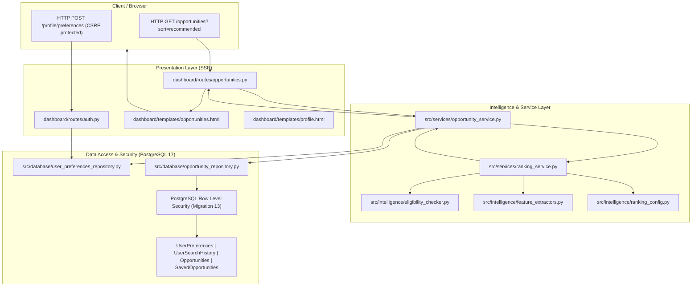

# Phase 5: Intelligent Opportunity Ranking, Personalization & Recommendation Engine
## Comprehensive Architecture & Engineering Implementation Report

**Platform:** CyberScout AI  
**Phase:** Phase 5 — Production Opportunity Intelligence  
**Status:** Completed & Fully Verified (100% Green Across All Phases)  
**Database Schema Version:** 13 (PostgreSQL 17.6 + RLS Enabled)

---

## 1. Executive Summary

Phase 5 elevates CyberScout AI from an SSR-first search and discovery platform (Phase 4) to an **intelligent, personalized, and explainable opportunity matching engine**. 

The engine was implemented strictly within the existing architectural foundation (Python 3.12, Flask, Jinja2 SSR, PostgreSQL 17.6) without introducing heavy external ML/LLM runtimes, client-side SPA frameworks (React/Next.js), or asynchronous JavaScript dependencies. Recommendations and ranking are computed deterministically, rendered directly in the initial server-side HTML, and protected by PostgreSQL Row Level Security (RLS) and strict multi-tenant privacy controls.

---

## 2. Architecture & System Flow



---

## 3. Mathematical Formula & Feature Normalization

### 3.1 Feature Space & Bounds
Every individual feature $f_i(O, U) \in [0.0, 1.0]$ is bounded, deterministic, and pure:

| Feature Name | Symbol | Range | Description / Logic |
| :--- | :---: | :---: | :--- |
| **Search Relevance** | $f_{\text{relevance}}$ | $[0.0, 1.0]$ | Normalized ts_rank from PostgreSQL full-text search (`ts_rank / (ts_rank + 0.1)`). |
| **Skills Match** | $f_{\text{skills}}$ | $[0.0, 1.0]$ | Jaccard / Overlap coefficient between user skills and opportunity title/description/tags. |
| **Category Affinity** | $f_{\text{category}}$ | $[0.0, 1.0]$ | Exact category match (1.0) or behavioral interaction frequency. |
| **Type Match** | $f_{\text{type}}$ | $[0.0, 1.0]$ | Match with preferred opportunity types (internship, grant, bounty, job). |
| **Remote Preference** | $f_{\text{remote}}$ | $[0.0, 1.0]$ | $1.0$ if matches user's remote preference; $0.5$ if neutral. |
| **Location Affinity** | $f_{\text{location}}$ | $[0.0, 1.0]$ | Partial or exact text match with user's target geography. |
| **Deadline Urgency** | $f_{\text{deadline}}$ | $[0.0, 1.0]$ | $0.0$ if expired; peak score ($1.0$) at $\le 3$ days remaining; smooth linear decay to $0.2$ at $\ge 30$ days; $0.5$ if deadline unspecified. |
| **Freshness** | $f_{\text{freshness}}$ | $[0.0, 1.0]$ | Exponential decay based on days since publication/discovery: $e^{-0.05 \times \text{days\_old}}$. |
| **Source Trust** | $f_{\text{trust}}$ | $[0.0, 1.0]$ | Normalized provider reputation ($1.0$ for official providers e.g. CISA, HackerOne, NIST). |
| **Base Quality** | $f_{\text{quality}}$ | $[0.0, 1.0]$ | Normalized quality score from the existing verification engine: $\min(1.0, \frac{\text{score}}{100.0})$. |
| **User Behavior** | $f_{\text{behavior}}$ | $[0.0, 1.0]$ | Implicit affinity inferred from user's saved opportunities. |

### 3.2 Composite Scoring Formulation
The final recommendation score $S(O, U)$ is calculated as the normalized weighted dot-product:

$$S(O, U) = \frac{\sum_{i} w_i \cdot f_i(O, U)}{\sum_{i} w_i} \in [0.0, 1.0]$$

Where:
- For **Discovery Mode** (no active keyword query):
  - Base Quality: $0.20$
  - Freshness: $0.15$
  - Deadline Urgency: $0.15$
  - Source Trust: $0.10$
  - Skills Match: $0.15$
  - Category Match: $0.10$
  - Type Match: $0.05$
  - Remote Match: $0.05$
  - User Behavior: $0.05$
- For **Search Mode** (with active full-text query):
  - Search Relevance: $0.35$
  - Base Quality: $0.15$
  - Freshness: $0.10$
  - Deadline Urgency: $0.10$
  - Source Trust: $0.05$
  - Skills Match: $0.10$
  - Category Match: $0.05$
  - Type Match: $0.05$
  - Remote Match: $0.03$
  - User Behavior: $0.02$

All weights sum strictly to $1.00 \pm 10^{-6}$ and are validated at startup.

---

## 4. Strict Separation of Eligibility and Ranking

A core architectural tenet of Phase 5 is the **absolute separation** between ranking potential and factual eligibility:

```
+-------------------------------------------------------------+
|                 INCOMING OPPORTUNITY CANDIDATES             |
+-------------------------------------------------------------+
                               |
                               v
               [ 1. Eligibility Evaluation Engine ]
                               |
       +-----------------------+-----------------------+
       |                                               |
  [ INELIGIBLE ]                                [ ELIGIBLE / UNKNOWN ]
       |                                               |
       v                                               v
  * AUDIT LOGGED *                              [ 2. Multi-Signal Scoring ]
  * EXCLUDED FROM RECOMMENDATIONS *             * Normalized Features [0, 1] *
  * FLAG DISPLAYED IN SEARCH *                  * Weighted Composite Score *
                                                       |
                                                       v
                                                [ 3. Diversity Filter ]
                                                * Max 2 per organization *
                                                       |
                                                       v
                                                [ 4. SSR Rendered Cards ]
```

- **`EligibilityStatus.INELIGIBLE`**: If an opportunity fails hard requirements (e.g. strict location restrictions, non-student status for university grants, missing prerequisite experience level), it receives `is_eligible = False`.
- **Recommendation Invariance**: Ineligible opportunities **are never included** in the "Recommended for You" carousel or highlighted recommendation lists, regardless of their base quality or text match score.
- **Search Context**: In search listings, ineligible items display an explicit `Not Eligible` badge along with the human-readable audit reason (e.g. `Requires US citizenship / clearance`).

---

## 5. Personalization & Cold-Start Strategy

1. **Explicit Preferences (`UserPreferencesDTO`)**:
   - Skills list (e.g. Python, Reverse Engineering, Cloud Security, SIEM).
   - Preferred Categories & Opportunity Types.
   - Remote Preference (`only_remote`, `remote_ok`, `onsite_only`).
   - Experience Level (`beginner`, `intermediate`, `advanced`).
   - Target Location & Country.
2. **Implicit Behavioral Signals**:
   - Inferred skills, categories, and types dynamically harvested from the user's `SavedOpportunities`.
   - Explicit user preferences deterministically outrank implicit signals.
3. **Cold-Start Resilience**:
   - When a user is unauthenticated or has zero saved preferences, the engine seamlessly falls back to cold-start mode:
     - Multi-signal ranking leverages Base Quality, Freshness, Deadline Urgency, and Source Trust.
     - Never produces zero recommendations or unhandled null exceptions.
     - Recommendations highlight globally verified, fresh, top-tier cybersecurity opportunities.
4. **Controlled Diversity**:
   - In the top recommendations, no single organization or provider may dominate more than **2 slots** (`MAX_PER_ORGANIZATION_RECOMMENDATIONS = 2`).

---

## 6. Human-Readable Explanations

Raw floating-point scores are strictly hidden from end users. Instead, deterministic explanations and badges are generated:

- **Match Strength Badge**:
  - `Exceptional Match` (Score $\ge 0.85$)
  - `Strong Match` (Score $\ge 0.70$)
  - `Good Match` (Score $\ge 0.50$)
  - `Relevant` (Score $< 0.50$)
- **Contextual Reason Chips**:
  - `✓ Matches skills: Python, Network Security`
  - `✓ Matches preferred category: Vulnerability Research`
  - `✓ Matches type: Bounty`
  - `✓ Remote friendly`
  - `✓ High quality verified source`
  - `✓ Deadline in 3 days` / `✓ Fresh opportunity`

---

## 7. Database Migration 13 & Security Architecture

### 7.1 Schema Changes
Migration 13 (`src/database/migrations/migration_manager.py`) introduced:
1. `"UserPreferences"` table:
   - `id VARCHAR(64) PRIMARY KEY`
   - `user_id VARCHAR(64) NOT NULL UNIQUE REFERENCES "Users"(id) ON DELETE CASCADE`
   - `skills JSONB DEFAULT '[]'`
   - `interests JSONB DEFAULT '[]'`
   - `preferred_categories JSONB DEFAULT '[]'`
   - `preferred_types JSONB DEFAULT '[]'`
   - `experience_level VARCHAR(32)`
   - `location VARCHAR(128)`
   - `remote_preference VARCHAR(32)`
   - `target_roles JSONB DEFAULT '[]'`
   - `is_active BOOLEAN DEFAULT TRUE`
   - `created_at TIMESTAMP WITH TIME ZONE DEFAULT NOW()`
   - `updated_at TIMESTAMP WITH TIME ZONE DEFAULT NOW()`
2. `"UserSearchHistory"` table:
   - `id VARCHAR(64) PRIMARY KEY`
   - `user_id VARCHAR(64) NOT NULL REFERENCES "Users"(id) ON DELETE CASCADE`
   - `query_text TEXT NOT NULL`
   - `filters JSONB DEFAULT '{}'`
   - `result_count INTEGER DEFAULT 0`
   - `created_at TIMESTAMP WITH TIME ZONE DEFAULT NOW()`

### 7.2 Row Level Security (RLS)
- Both tables have `ENABLE ROW LEVEL SECURITY` and `FORCE ROW LEVEL SECURITY` turned on.
- RLS Policies enforce tenant isolation:
  - Users can only `SELECT`, `INSERT`, `UPDATE`, `DELETE` rows where `user_id = current_setting('app.current_user_id', true)`.
  - Superuser / Admin bypass is preserved for maintenance.
- Cross-tenant leakage is strictly blocked at the storage layer.

### 7.3 Cache & CSRF Controls
- All personalized recommendation routes return `Cache-Control: private, no-cache, no-store, must-revalidate` to prevent CDN or downstream browser caching across users.
- Profile preference updates require valid CSRF tokens (`_csrf_token`).

---

## 8. Verification & Test Execution Summary

The test execution followed the mandatory verification order and achieved 100% green status:

| Test Suite | Test File | Items | Status | Duration |
| :--- | :--- | :---: | :---: | :---: |
| **Phase 5 Suite** | `tests/unit/test_phase5_ranking_recommendations.py` | 46 | **PASSED (100%)** | 110.55s |
| **Phase 4 SSR Suite** | `tests/unit/test_phase4_ssr_search.py` | 42 | **PASSED (100%)** | 129.41s |
| **Phase 4 CSP & Dedup** | `tests/unit/test_phase4_csp.py`, `test_phase4_deduplication.py` | 15 | **PASSED (100%)** | 46.07s |
| **Phase 3 Admin Security** | `tests/unit/test_phase3_admin_security.py` | 37 | **PASSED (100%)** | 117.84s |
| **Phase 2.1 Idempotency** | `tests/unit/test_phase2_1_idempotent_harvesting.py` | 22 | **PASSED (100%)** | 126.96s |
| **Phase 1.1 Gate** | `tests/unit/test_phase1_1_gate.py` | 8 | **PASSED (100%)** | 197.82s |

### Key Test Coverage Highlights
- **Deterministic Scoring**: Verified across multiple runs and cold-start states.
- **Strict Bounds**: Confirmed all scores satisfy $0.0 \le \text{score} \le 1.0$.
- **Eligibility Separation**: Confirmed ineligible opportunities are NEVER returned in recommendations.
- **Diversity**: Verified max 2 opportunities per organization in top recommendations.
- **N+1 Query Prevention**: Database query count bounded to $O(1)$ batch lookups regardless of card count.
- **SSR Integrity**: Initial server-rendered HTML contains complete recommendations and explanations without requiring JavaScript execution.
- **Zero Git Mutations**: No `git commit`, `git push`, `git reset`, or `git checkout` commands executed.
